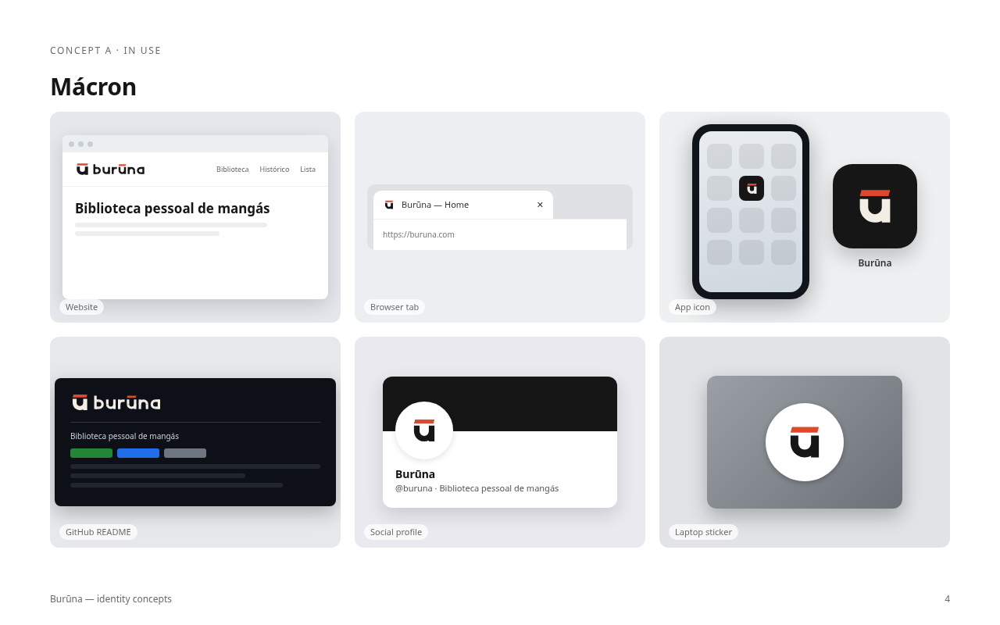

# Marca Burūna

Burūna é "Bruna" em japonês. O projeto leva o nome dela, que gostava muito de mangá e
anime. A marca parte do único sinal que só esse nome tem: o **ū**.

## A ideia

O símbolo é o ū do nome. O mácron funciona como o primeiro quadro de uma página de mangá, e
o espaço até o u faz o papel da calha. O mácron tem as pontas cortadas a 15°, e esse ângulo
se repete no símbolo e no logotipo. Todas as letras são construídas: não há fonte por trás,
logo não há licença de fonte envolvida.

## Arquivos

| Arquivo | Uso |
| --- | --- |
| `buruna-wordmark.svg` / `-reversed` / `-black` | Logotipo principal: header, login, README |
| `buruna-symbol.svg` / `-reversed` / `-black` | Símbolo: avatar, ícone, selo |
| `buruna-symbol-small.svg` | Corte para 16–24 px (mácron mais grosso, respiro maior) |
| `buruna-horizontal.svg` / `-reversed` | Símbolo + logotipo lado a lado |
| `buruna-stacked.svg` / `-reversed` | Símbolo sobre o logotipo (splash, capa) |
| `buruna-app-icon.svg` | Ícone de app sobre fundo tinta |

`-reversed` é para fundo escuro e `-black` é para impressão em uma cor. Os ícones web
(`favicon.ico`, `favicon.svg`, `apple-touch-icon.png`, `icon-*.png`, `site.webmanifest`)
ficam em `frontend/public/`. No app, use o componente `Wordmark`
e `LogoMark` (`frontend/src/components/Logo.tsx`): as letras herdam a cor do texto. As
telas de autenticação usam `AuthLayout`, que já traz o logotipo.

## Cores

| Nome | HEX | RGB | Uso |
| --- | --- | --- | --- |
| Tinta | `#161616` | 22 22 22 | Letras em fundo claro, fundo dos ícones |
| Papel | `#F2EEE6` | 242 238 230 | Letras em fundo escuro |
| Shu (vermelhão) | `#E0482D` | 224 72 45 | **Só o mácron.** É a cor do carimbo hanko |

O shu é a assinatura da marca. Ele aparece no mácron e em nenhum outro elemento do logo.
Na versão em uma cor, o mácron acompanha a cor das letras.

No frontend as três cores são tokens (`--ink`, `--paper`, `--shu` em `index.css`) e
classes do Tailwind (`bg-ink`, `text-paper`, `fill-shu`…). O tema escuro do app é
construído sobre elas: fundo tinta, texto papel, foco em shu.

## Linguagem visual

Além do logo, a marca fala a língua da página de mangá: quadros com traço de tinta,
calha inclinada a 15°, retícula de pontos e linhas de velocidade. A referência é a
arte das telas de autenticação (`frontend/src/components/MangaPageArt.tsx`).

## Regras de uso

- **Área de proteção:** deixe livre, em volta de qualquer versão, pelo menos a altura do mácron.
- **Tamanho mínimo:** o logotipo pode ter no mínimo 14 px de altura (≈ 70 px de largura). O
  símbolo pode ter no mínimo 16 px; abaixo de 24 px, use `buruna-symbol-small.svg`.
- **Fundos:** use tinta ou papel, ou outro fundo liso com contraste. Sobre foto, só com
  a versão de uma cor.
- **Não faça:**
  - não troque o shu por outra cor;
  - não pinte as letras de shu;
  - não endireite o corte do mácron;
  - não distorça, gire ou aplique sombra ou gradiente;
  - não reescreva "burūna" com uma fonte;
  - não remova o mácron.
